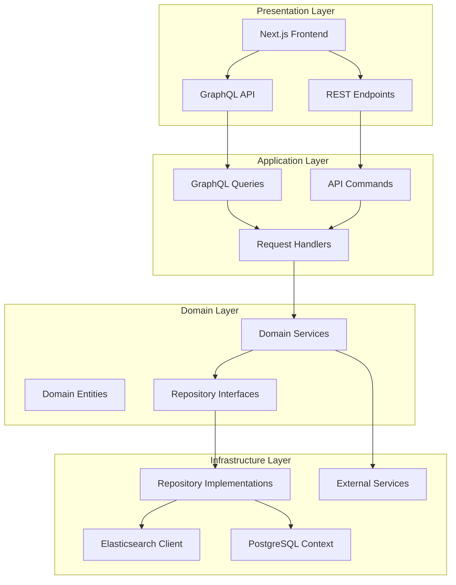
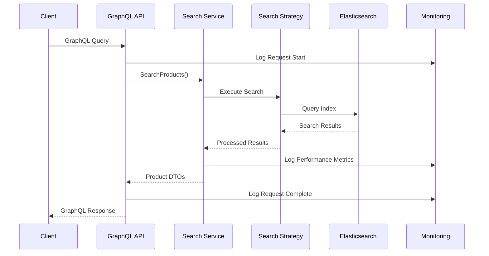
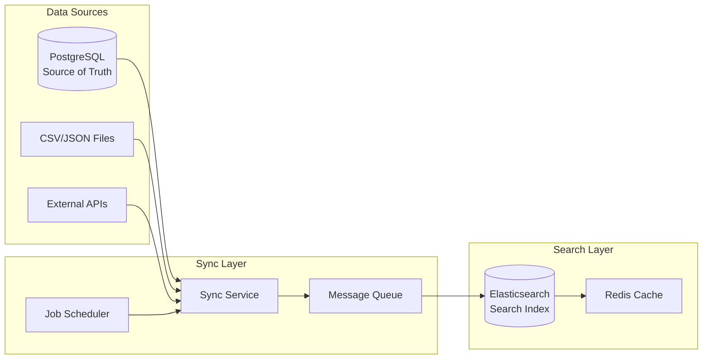
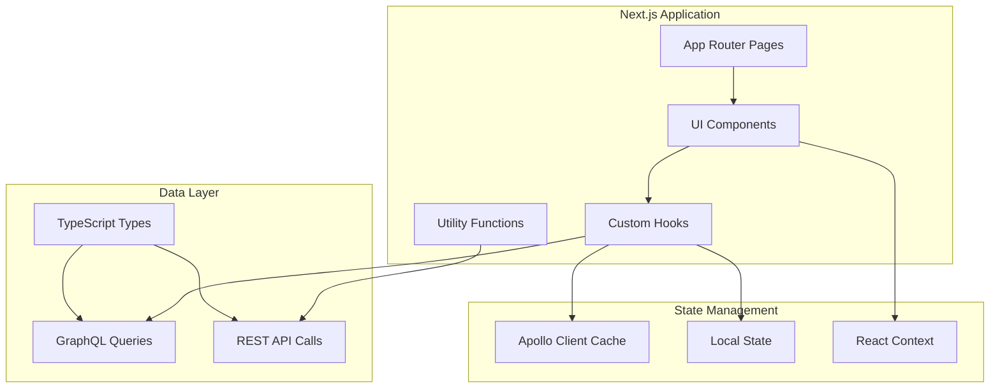
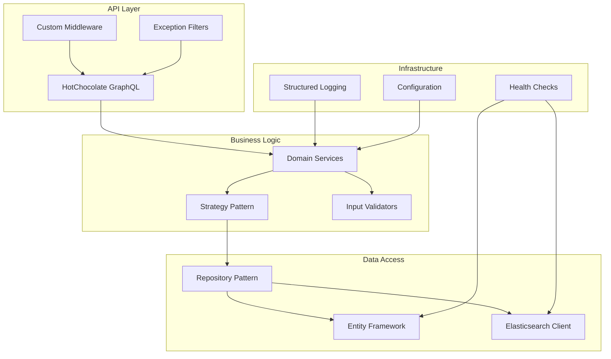
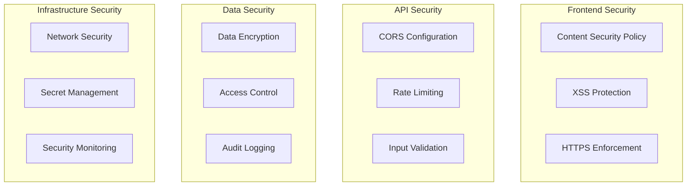
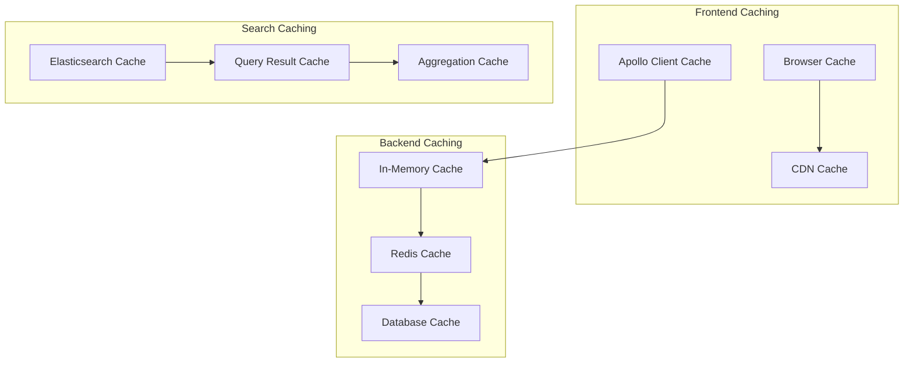
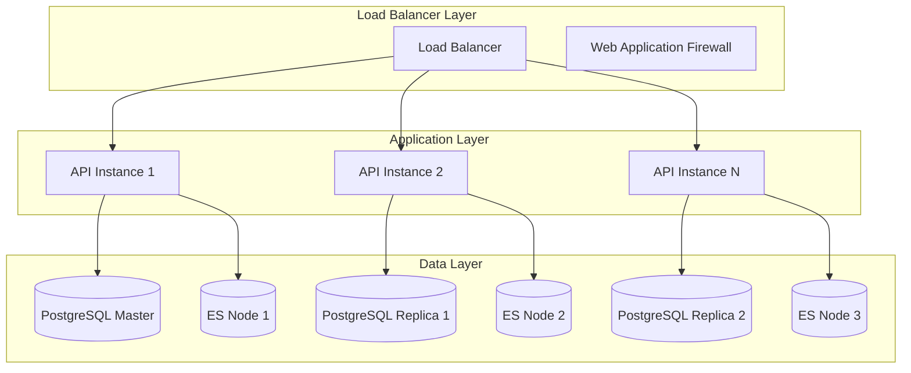
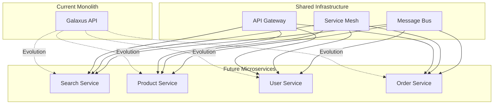
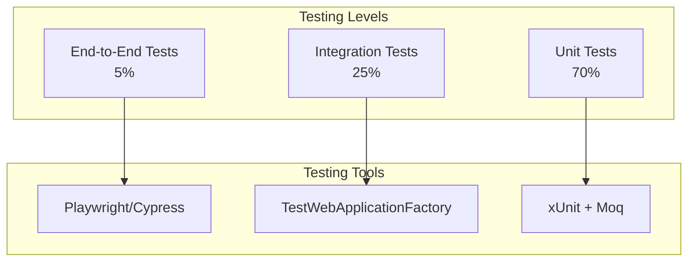

# Architecture Documentation

## 🏗️ **System Architecture Overview**

The Galaxus Product Search application follows a modern, layered architecture that promotes separation of concerns, testability, and scalability. This document provides a comprehensive view of the architectural decisions and patterns implemented.

## 📐 **Architectural Patterns**

### **Clean Architecture Implementation**



### **SOLID Principles Application**

#### **Single Responsibility Principle**

Each class has a single, well-defined responsibility:

```csharp
// ✅ Single responsibility - only handles PostgreSQL data access
public class PostgresProductRepository : IProductRepository
{
    // Only contains database access logic
}

// ✅ Single responsibility - only handles search operations
public class ElasticsearchService : IProductSearchService
{
    // Only contains search logic
}

// ✅ Single responsibility - only handles monitoring
public class MonitoringService : IMonitoringService
{
    // Only contains logging and metrics logic
}
```

#### **Open/Closed Principle**

The system is open for extension but closed for modification:

```csharp
// ✅ Interface allows extension without modification
public interface ISearchStrategy
{
    ISearchResponse<Product> Search(/* parameters */);
}

// ✅ New search strategies can be added without changing existing code
public class ElasticsearchSearchStrategy : ISearchStrategy { }
public class SolrSearchStrategy : ISearchStrategy { } // Future extension
```

#### **Liskov Substitution Principle**

Derived classes are substitutable for their base classes:

```csharp
// ✅ Any IProductRepository implementation can be substituted
IProductRepository repo = new PostgresProductRepository();
// OR
IProductRepository repo = new InMemoryProductRepository(); // For testing
```

#### **Interface Segregation Principle**

Interfaces are client-specific and focused:

```csharp
// ✅ Focused interfaces instead of monolithic ones
public interface IProductRepository { /* Read/Write operations */ }
public interface IProductSearchService { /* Search operations */ }
public interface IMonitoringService { /* Monitoring operations */ }
```

#### **Dependency Inversion Principle**

High-level modules don't depend on low-level modules:

```csharp
// ✅ Depends on abstraction, not concrete implementation
public class Query
{
    private readonly IProductSearchService _searchService;

    // Dependency injected, not instantiated
    public Query(IProductSearchService searchService)
    {
        _searchService = searchService;
    }
}
```

## 🔄 **Data Flow Architecture**

### **Request Processing Flow**



### **Data Synchronization Flow**



## 🧱 **Component Architecture**

### **Frontend Architecture**



### **Backend Architecture**



## 🏗️ **Design Patterns Implementation**

### **Repository Pattern**

Abstracts data access logic and provides a uniform interface:

```csharp
public interface IProductRepository
{
    Task<IEnumerable<Product>> GetProductsAsync(int page, int size);
    Task<Product?> GetProductByIdAsync(string id);
    Task<Product> CreateProductAsync(Product product);
    Task<Product> UpdateProductAsync(Product product);
    Task<bool> DeleteProductAsync(string id);
}

public class PostgresProductRepository : IProductRepository
{
    private readonly ApplicationDbContext _context;

    // Implementation uses Entity Framework for data access
}
```

### **Strategy Pattern**

Enables different search implementations to be used interchangeably:

```csharp
public interface ISearchStrategy
{
    ISearchResponse<Product> Search(
        string? query,
        string? category,
        decimal? minPrice,
        decimal? maxPrice,
        int size = 1000);
}

public class ElasticsearchSearchStrategy : ISearchStrategy
{
    // Elasticsearch-specific search implementation
}

public class PostgresSearchStrategy : ISearchStrategy
{
    // PostgreSQL-specific search implementation (fallback)
}
```

### **Factory Pattern**

Creates appropriate strategy instances based on configuration:

```csharp
public class SearchStrategyFactory
{
    public ISearchStrategy CreateStrategy(SearchType type)
    {
        return type switch
        {
            SearchType.Elasticsearch => new ElasticsearchSearchStrategy(),
            SearchType.Postgres => new PostgresSearchStrategy(),
            _ => throw new ArgumentException("Invalid search type")
        };
    }
}
```

### **Observer Pattern**

Implements monitoring and logging across the application:

```csharp
public interface IMonitoringService
{
    void LogUserAction(string action, object metadata);
    void LogError(Exception error, string context, object metadata);
    void LogPerformance(string metric, double value, object metadata);
}

// Components observe and report to monitoring service
public class SearchService
{
    private readonly IMonitoringService _monitoring;

    public async Task<SearchResult> SearchAsync(string query)
    {
        _monitoring.LogUserAction("search_initiated", new { query });
        // ... search logic
        _monitoring.LogPerformance("search_duration", duration);
    }
}
```

## 🔐 **Security Architecture**

### **Security Layers**



### **Input Validation Architecture**

```csharp
public static class InputValidator
{
    private static readonly Regex QuerySanitizationRegex =
        new(@"[<>""'&]", RegexOptions.Compiled);

    public static void ValidateSearchParameters(
        string? query,
        string? category,
        decimal? minPrice,
        decimal? maxPrice,
        int size)
    {
        // Comprehensive validation with business rules
        if (size <= 0 || size > 1000)
            throw new ArgumentException("Size must be between 1 and 1000");

        if (!string.IsNullOrEmpty(query) && query.Length > 100)
            throw new ArgumentException("Query cannot exceed 100 characters");

        // Category validation against allowed values
        if (!string.IsNullOrEmpty(category) &&
            !ValidCategories.Contains(category, StringComparer.OrdinalIgnoreCase))
            throw new ArgumentException($"Invalid category");
    }
}
```

## 📊 **Performance Architecture**

### **Caching Strategy**



### **Connection Pooling**

```csharp
// PostgreSQL connection pooling configuration
services.AddDbContext<ApplicationDbContext>(options =>
{
    options.UseNpgsql(connectionString, npgsqlOptions =>
    {
        npgsqlOptions.CommandTimeout(30);
        npgsqlOptions.EnableRetryOnFailure(
            maxRetryCount: 3,
            maxRetryDelay: TimeSpan.FromSeconds(5),
            errorCodesToAdd: null);
    });
}, ServiceLifetime.Scoped);

// Elasticsearch connection pooling
services.AddSingleton<ElasticClient>(provider =>
{
    var settings = new ConnectionSettings(new Uri(elasticsearchUrl))
        .DefaultIndex("products")
        .EnableApiVersioningHeader()
        .MaximumRetries(3)
        .MaxRetryTimeout(TimeSpan.FromSeconds(30));

    return new ElasticClient(settings);
});
```

## 🔄 **Scalability Architecture**

### **Horizontal Scaling Strategy**



### **Microservices Evolution Path**



## 🧪 **Testing Architecture**

### **Testing Pyramid**



### **Test Strategy Implementation**

```csharp
// Unit Test Example
[Fact]
public async Task SearchProducts_ValidQuery_ReturnsProducts()
{
    // Arrange
    var mockRepository = new Mock<IProductRepository>();
    var service = new ProductSearchService(mockRepository.Object);

    // Act
    var result = await service.SearchAsync("laptop");

    // Assert
    Assert.NotNull(result);
    Assert.True(result.Products.Any());
}

// Integration Test Example
public class SearchIntegrationTests : IClassFixture<WebApplicationFactory<Program>>
{
    private readonly WebApplicationFactory<Program> _factory;

    [Fact]
    public async Task GraphQL_SearchProducts_ReturnsValidResponse()
    {
        // Full integration test with real database
    }
}
```

This architecture provides a solid foundation for a scalable, maintainable, and testable e-commerce search platform that can evolve with changing requirements and growing user demands.
