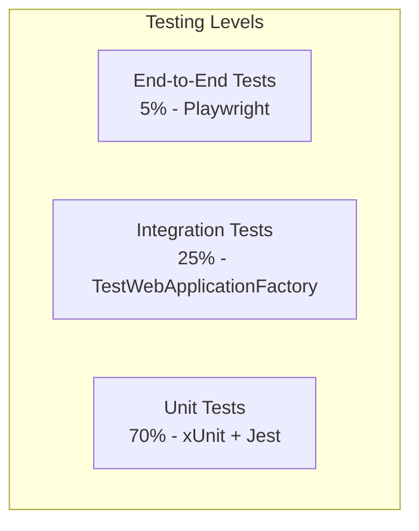

# Development Guide

## 🚀 **Getting Started**

This guide provides comprehensive information for developers working on the Galaxus Product Search project. It covers setup, development workflows, coding standards, and contribution guidelines.

## 🛠️ **Development Environment Setup**

### **Prerequisites**

| Tool               | Version | Purpose                 |
| ------------------ | ------- | ----------------------- |
| Docker Desktop     | Latest  | Container orchestration |
| .NET SDK           | 9.0+    | Backend development     |
| Node.js            | 18+     | Frontend development    |
| Git                | Latest  | Version control         |
| Visual Studio Code | Latest  | Recommended IDE         |

### **Recommended VS Code Extensions**

```json
{
  "recommendations": [
    "ms-dotnettools.csharp",
    "ms-dotnettools.vscode-dotnet-runtime",
    "bradlc.vscode-tailwindcss",
    "GraphQL.vscode-graphql",
    "ms-vscode.vscode-typescript-next",
    "esbenp.prettier-vscode",
    "ms-vscode.vscode-json"
  ]
}
```

### **Quick Setup**

1. **Clone the repository**

```powershell
git clone <repository-url>
cd galaxus
```

2. **Start infrastructure services**

```powershell
docker-compose up -d
```

3. **Setup backend**

```powershell
cd backend
dotnet restore
dotnet build
dotnet run
```

4. **Setup frontend** (new terminal)

```powershell
cd frontend
npm install
npm run dev
```

5. **Initialize database**

```powershell
# Run database migrations and seeding
docker exec galaxus_postgres psql -U galaxus -d galaxus -f /docker-entrypoint-initdb.d/init.sql
```

6. **Sync Elasticsearch**

```powershell
# PowerShell
Invoke-WebRequest -Uri "http://localhost:5119/api/sync-elastic" -Method POST

# Or curl
curl -X POST http://localhost:5119/api/sync-elastic
```

## 🏗️ **Project Structure Deep Dive**

### **Backend Structure**

```
backend/
├── GraphQL/                    # GraphQL schema and resolvers
│   ├── Query.cs               # Main GraphQL queries
│   └── GraphQLErrorFilter.cs  # Error handling
├── Services/                   # Business logic layer
│   ├── IProductRepository.cs   # Data access interface
│   ├── PostgresProductRepository.cs # PostgreSQL implementation
│   ├── IProductSearchService.cs # Search interface
│   ├── ElasticsearchService.cs # Search implementation
│   ├── MonitoringService.cs    # Logging and metrics
│   └── Strategies/            # Strategy pattern implementations
├── Models/                     # Domain entities
│   └── Product.cs             # Product domain model
├── DTOs/                      # Data transfer objects
│   ├── ProductDto.cs          # API response model
│   └── ProductMapper.cs       # Entity to DTO mapping
├── HealthChecks/              # Health monitoring
│   └── HealthChecks.cs        # PostgreSQL and Elasticsearch checks
├── Middleware/                # Custom middleware
│   └── MonitoringMiddleware.cs # Request/response monitoring
└── Tests/                     # Comprehensive test suite
    ├── GraphQL/               # GraphQL query tests
    ├── Services/              # Service layer tests
    ├── Integration/           # Integration tests
    ├── Performance/           # Load tests
    └── Security/              # Security tests
```

### **Frontend Structure**

```
frontend/src/
├── app/                       # Next.js App Router
│   ├── layout.tsx            # Root layout
│   ├── page.tsx              # Home page
│   ├── globals.css           # Global styles
│   └── api/                  # API routes (if needed)
├── components/               # Reusable UI components
│   ├── ProductCard.tsx       # Product display component
│   ├── SearchBar.tsx         # Search input component
│   ├── FilterPanel.tsx       # Filter controls
│   └── ui/                   # Base UI components
├── hooks/                    # Custom React hooks
│   ├── useProducts.ts        # Product search hook
│   ├── useDebounce.ts        # Debouncing utility
│   └── useLocalStorage.ts    # Local storage hook
├── types/                    # TypeScript type definitions
│   ├── Product.ts            # Product type
│   ├── GraphQL.ts            # GraphQL response types
│   └── API.ts                # API interface types
└── utils/                    # Utility functions
    ├── apollo-client.ts      # GraphQL client setup
    ├── buildSearchProductsQuery.ts # Query builder
    ├── monitoring.ts         # Frontend monitoring
    └── auth.ts               # Authentication utilities
```

## 🔄 **Development Workflow**

### **Git Workflow**

We follow the **GitFlow** branching model:

```mermaid
gitgraph
    commit id: "Initial"
    branch develop
    checkout develop
    commit id: "Setup"
    branch feature/search-filters
    checkout feature/search-filters
    commit id: "Add filters"
    commit id: "Add tests"
    checkout develop
    merge feature/search-filters
    checkout main
    merge develop
    tag: "v1.0.0"
```

### **Branch Naming Convention**

| Branch Type | Format                | Example                      |
| ----------- | --------------------- | ---------------------------- |
| Feature     | `feature/description` | `feature/add-search-filters` |
| Bugfix      | `bugfix/description`  | `bugfix/fix-pagination-bug`  |
| Hotfix      | `hotfix/description`  | `hotfix/security-patch`      |
| Release     | `release/version`     | `release/v1.2.0`             |

### **Commit Message Convention**

We use [Conventional Commits](https://www.conventionalcommits.org/):

```
<type>[optional scope]: <description>

[optional body]

[optional footer(s)]
```

**Examples:**

```
feat(search): add category filtering
fix(api): resolve GraphQL validation error
docs(readme): update setup instructions
test(integration): add health check tests
```

### **Pull Request Process**

1. **Create feature branch**

```powershell
git checkout develop
git pull origin develop
git checkout -b feature/your-feature-name
```

2. **Make changes and commit**

```powershell
git add .
git commit -m "feat(component): add new feature"
```

3. **Push and create PR**

```powershell
git push origin feature/your-feature-name
# Create PR via GitHub interface
```

4. **PR Requirements**

- [ ] All tests pass
- [ ] Code coverage >= 80%
- [ ] No security vulnerabilities
- [ ] Documentation updated
- [ ] Peer review approved

## 🧪 **Testing Strategy**

### **Testing Pyramid**



### **Backend Testing**

#### **Unit Tests**

```csharp
[Fact]
public async Task SearchProducts_ValidQuery_ReturnsProducts()
{
    // Arrange
    var mockRepository = new Mock<IProductRepository>();
    var expectedProducts = new List<Product> { /* test data */ };
    mockRepository.Setup(r => r.GetProductsAsync(It.IsAny<int>(), It.IsAny<int>()))
               .ReturnsAsync(expectedProducts);

    var service = new ProductSearchService(mockRepository.Object);

    // Act
    var result = await service.SearchAsync("laptop");

    // Assert
    Assert.NotNull(result);
    Assert.Equal(expectedProducts.Count, result.Count());
}
```

#### **Integration Tests**

```csharp
public class SearchIntegrationTests : IClassFixture<WebApplicationFactory<Program>>
{
    private readonly WebApplicationFactory<Program> _factory;
    private readonly HttpClient _client;

    public SearchIntegrationTests(WebApplicationFactory<Program> factory)
    {
        _factory = factory;
        _client = _factory.CreateClient();
    }

    [Fact]
    public async Task GraphQL_SearchProducts_ReturnsValidResponse()
    {
        // Arrange
        var query = @"
        {
            ""query"": ""query { searchProducts(size: 5) { id name price } }""
        }";

        // Act
        var response = await _client.PostAsync("/graphql",
            new StringContent(query, Encoding.UTF8, "application/json"));

        // Assert
        response.EnsureSuccessStatusCode();
        var content = await response.Content.ReadAsStringAsync();
        var result = JsonSerializer.Deserialize<GraphQLResponse>(content);

        Assert.NotNull(result.Data);
        Assert.True(result.Data.SearchProducts.Any());
    }
}
```

### **Frontend Testing**

#### **Component Tests**

```typescript
import { render, screen, fireEvent, waitFor } from "@testing-library/react";
import { MockedProvider } from "@apollo/client/testing";
import ProductSearch from "./ProductSearch";

const mocks = [
  {
    request: {
      query: SEARCH_PRODUCTS,
      variables: { query: "laptop", size: 20 },
    },
    result: {
      data: {
        searchProducts: [
          {
            id: "1",
            name: "Test Laptop",
            price: 999.99,
            category: "Electronics",
          },
        ],
      },
    },
  },
];

test("renders search results", async () => {
  render(
    <MockedProvider mocks={mocks} addTypename={false}>
      <ProductSearch />
    </MockedProvider>
  );

  const searchInput = screen.getByPlaceholderText("Search products...");
  fireEvent.change(searchInput, { target: { value: "laptop" } });

  await waitFor(() => {
    expect(screen.getByText("Test Laptop")).toBeInTheDocument();
  });
});
```

#### **Hook Tests**

```typescript
import { renderHook, waitFor } from "@testing-library/react";
import { MockedProvider } from "@apollo/client/testing";
import { useProducts } from "./useProducts";

test("useProducts hook returns products", async () => {
  const wrapper = ({ children }) => (
    <MockedProvider mocks={mocks}>{children}</MockedProvider>
  );

  const { result } = renderHook(
    () => useProducts({ query: "laptop", category: "", size: 10 }),
    { wrapper }
  );

  await waitFor(() => {
    expect(result.current.loading).toBe(false);
    expect(result.current.products).toHaveLength(1);
  });
});
```

### **Running Tests**

#### **Backend Tests**

```powershell
# All tests
cd backend
dotnet test

# Specific test category
dotnet test --filter "Category=Unit"
dotnet test --filter "Category=Integration"
dotnet test --filter "Category=Performance"

# With coverage
dotnet test --collect:"XPlat Code Coverage"
```

#### **Frontend Tests**

```powershell
# All tests
cd frontend
npm test

# Watch mode
npm test -- --watch

# Coverage
npm test -- --coverage

# Specific test file
npm test ProductSearch.test.tsx
```

## 📊 **Code Quality Standards**

### **C# Coding Standards**

#### **Naming Conventions**

```csharp
// ✅ Classes: PascalCase
public class ProductRepository { }

// ✅ Methods: PascalCase
public async Task<Product> GetProductAsync(string id) { }

// ✅ Properties: PascalCase
public string ProductName { get; set; }

// ✅ Fields: camelCase with underscore prefix
private readonly ILogger _logger;

// ✅ Parameters: camelCase
public void ProcessProduct(string productId, decimal price) { }

// ✅ Constants: PascalCase
public const int MaxRetryAttempts = 3;
```

#### **Code Structure**

```csharp
// ✅ Proper async/await usage
public async Task<IEnumerable<Product>> GetProductsAsync()
{
    try
    {
        var products = await _repository.GetAllAsync();
        return products.Select(ProductMapper.ToDto);
    }
    catch (Exception ex)
    {
        _logger.LogError(ex, "Failed to retrieve products");
        throw new ServiceException("Unable to retrieve products", ex);
    }
}

// ✅ Proper dependency injection
public class ProductService
{
    private readonly IProductRepository _repository;
    private readonly ILogger<ProductService> _logger;

    public ProductService(IProductRepository repository, ILogger<ProductService> logger)
    {
        _repository = repository ?? throw new ArgumentNullException(nameof(repository));
        _logger = logger ?? throw new ArgumentNullException(nameof(logger));
    }
}
```

### **TypeScript/React Standards**

#### **Naming Conventions**

```typescript
// ✅ Components: PascalCase
const ProductCard: React.FC<ProductCardProps> = ({ product }) => {
  return <div>{product.name}</div>;
};

// ✅ Hooks: camelCase with "use" prefix
const useProducts = (config: UseProductsConfig) => {
  // hook implementation
};

// ✅ Types/Interfaces: PascalCase
interface Product {
  id: string;
  name: string;
  price: number;
}

// ✅ Constants: UPPER_SNAKE_CASE
const API_BASE_URL = process.env.NEXT_PUBLIC_API_URL;

// ✅ Variables/Functions: camelCase
const searchProducts = async (query: string) => {
  // implementation
};
```

#### **Component Structure**

```typescript
// ✅ Proper component structure
interface ProductCardProps {
  product: Product;
  onSelect?: (product: Product) => void;
}

export const ProductCard: React.FC<ProductCardProps> = ({
  product,
  onSelect,
}) => {
  const handleClick = useCallback(() => {
    onSelect?.(product);
  }, [product, onSelect]);

  return (
    <div
      className="product-card"
      onClick={handleClick}
      role="button"
      tabIndex={0}
    >
      <h3>{product.name}</h3>
      <p>${product.price}</p>
    </div>
  );
};
```

### **Code Formatting**

#### **EditorConfig** (`.editorconfig`)

```ini
root = true

[*]
charset = utf-8
end_of_line = crlf
insert_final_newline = true
indent_style = space
indent_size = 2

[*.cs]
indent_size = 4

[*.{json,yml,yaml}]
indent_size = 2
```

#### **Prettier Configuration** (`frontend/.prettierrc`)

```json
{
  "semi": true,
  "trailingComma": "es5",
  "singleQuote": true,
  "printWidth": 80,
  "tabWidth": 2,
  "useTabs": false
}
```

## 🔧 **Development Tools & Scripts**

### **Package Scripts**

#### **Backend** (`backend/Backend.Api.csproj`)

```xml
<PropertyGroup>
  <TargetFramework>net9.0</TargetFramework>
  <Nullable>enable</Nullable>
  <ImplicitUsings>enable</ImplicitUsings>
  <TreatWarningsAsErrors>true</TreatWarningsAsErrors>
</PropertyGroup>
```

#### **Frontend** (`frontend/package.json`)

```json
{
  "scripts": {
    "dev": "next dev",
    "build": "next build",
    "start": "next start",
    "lint": "next lint",
    "lint:fix": "next lint --fix",
    "test": "jest",
    "test:watch": "jest --watch",
    "test:coverage": "jest --coverage",
    "type-check": "tsc --noEmit"
  }
}
```

### **Development Scripts**

#### **Setup Script** (`scripts/setup.ps1`)

```powershell
# Complete development environment setup
Write-Host "Setting up Galaxus development environment..."

# Start Docker services
docker-compose up -d
Write-Host "✅ Docker services started"

# Backend setup
cd backend
dotnet restore
dotnet build
Write-Host "✅ Backend built successfully"

# Frontend setup
cd ../frontend
npm install
Write-Host "✅ Frontend dependencies installed"

# Database initialization
docker exec galaxus_postgres psql -U galaxus -d galaxus -f /docker-entrypoint-initdb.d/init.sql
Write-Host "✅ Database initialized"

# Elasticsearch sync
Start-Sleep -Seconds 10
Invoke-WebRequest -Uri "http://localhost:5119/api/sync-elastic" -Method POST
Write-Host "✅ Elasticsearch synced"

Write-Host "🚀 Development environment ready!"
Write-Host "Backend: http://localhost:5119"
Write-Host "Frontend: http://localhost:3000"
Write-Host "GraphQL Playground: http://localhost:5119/graphql"
```

### **Debug Configuration**

#### **VS Code Launch Configuration** (`.vscode/launch.json`)

```json
{
  "version": "0.2.0",
  "configurations": [
    {
      "name": ".NET Core Launch (Backend)",
      "type": "coreclr",
      "request": "launch",
      "preLaunchTask": "build",
      "program": "${workspaceFolder}/backend/bin/Debug/net9.0/Backend.Api.dll",
      "args": [],
      "cwd": "${workspaceFolder}/backend",
      "stopAtEntry": false,
      "serverReadyAction": {
        "action": "openExternally",
        "pattern": "\\bNow listening on:\\s+(https?://\\S+)"
      },
      "env": {
        "ASPNETCORE_ENVIRONMENT": "Development"
      }
    },
    {
      "name": "Attach to Node.js (Frontend)",
      "type": "node",
      "request": "attach",
      "port": 9229,
      "restart": true,
      "skipFiles": ["<node_internals>/**"]
    }
  ]
}
```

## 🚀 **Performance Optimization**

### **Backend Optimization**

#### **Database Queries**

```csharp
// ✅ Efficient queries with proper indexing
public async Task<IEnumerable<Product>> SearchProductsAsync(
    string query,
    string category,
    int page,
    int size)
{
    return await _context.Products
        .Where(p => string.IsNullOrEmpty(query) || p.Name.Contains(query))
        .Where(p => string.IsNullOrEmpty(category) || p.Category == category)
        .OrderBy(p => p.Name)
        .Skip(page * size)
        .Take(size)
        .AsNoTracking() // Read-only queries
        .ToListAsync();
}
```

#### **Caching Strategy**

```csharp
// ✅ Implementing caching for expensive operations
public async Task<IEnumerable<Product>> GetPopularProductsAsync()
{
    const string cacheKey = "popular_products";

    if (_cache.TryGetValue(cacheKey, out List<Product> cachedProducts))
    {
        return cachedProducts;
    }

    var products = await _repository.GetPopularProductsAsync();

    _cache.Set(cacheKey, products, TimeSpan.FromMinutes(15));

    return products;
}
```

### **Frontend Optimization**

#### **Memoization**

```typescript
// ✅ Memoized components and calculations
const ProductCard = React.memo<ProductCardProps>(({ product }) => {
  const formattedPrice = useMemo(
    () =>
      new Intl.NumberFormat("en-US", {
        style: "currency",
        currency: "USD",
      }).format(product.price),
    [product.price]
  );

  return (
    <div className="product-card">
      <h3>{product.name}</h3>
      <p>{formattedPrice}</p>
    </div>
  );
});
```

#### **Query Optimization**

```typescript
// ✅ Efficient GraphQL queries with proper field selection
const SEARCH_PRODUCTS = gql`
  query SearchProducts($query: String, $size: Int) {
    searchProducts(query: $query, size: $size) {
      id
      name
      price
      category
      # Only request fields that are actually used
    }
  }
`;
```

## 🔍 **Debugging Guide**

### **Common Issues & Solutions**

#### **"Invalid argument provided" Error**

```typescript
// ❌ Problem: Invalid category
const { products } = useProducts({
  query: "laptop",
  category: "InvalidCategory", // This category doesn't exist
});

// ✅ Solution: Use valid categories
const validCategories = [
  "Electronics",
  "Books",
  "Automotive",
  "Furniture",
  "Garden",
  "Home Appliances",
  "Sportswear",
  "Toys",
];

const { products } = useProducts({
  query: "laptop",
  category: "Electronics", // Valid category
});
```

#### **GraphQL Connection Issues**

```typescript
// ✅ Check Apollo Client configuration
const client = new ApolloClient({
  uri: process.env.NEXT_PUBLIC_API_URL || "http://localhost:5119/graphql",
  cache: new InMemoryCache(),
  defaultOptions: {
    watchQuery: {
      errorPolicy: "all",
      fetchPolicy: "cache-and-network",
    },
  },
});
```

### **Logging & Monitoring**

#### **Backend Logging**

```csharp
// ✅ Structured logging with correlation IDs
public async Task<SearchResult> SearchAsync(string query)
{
    using var scope = _logger.BeginScope(new Dictionary<string, object>
    {
        ["CorrelationId"] = Guid.NewGuid(),
        ["Operation"] = "ProductSearch",
        ["Query"] = query
    });

    _logger.LogInformation("Starting product search for query: {Query}", query);

    try
    {
        var result = await _searchService.SearchAsync(query);
        _logger.LogInformation("Search completed successfully. Found {Count} products", result.Count);
        return result;
    }
    catch (Exception ex)
    {
        _logger.LogError(ex, "Search failed for query: {Query}", query);
        throw;
    }
}
```

#### **Frontend Error Boundaries**

```typescript
// ✅ Error boundary for graceful error handling
class ErrorBoundary extends React.Component<
  React.PropsWithChildren<{}>,
  { hasError: boolean; error?: Error }
> {
  constructor(props: React.PropsWithChildren<{}>) {
    super(props);
    this.state = { hasError: false };
  }

  static getDerivedStateFromError(error: Error) {
    return { hasError: true, error };
  }

  componentDidCatch(error: Error, errorInfo: React.ErrorInfo) {
    console.error("Application error:", error, errorInfo);
    // Send to monitoring service
  }

  render() {
    if (this.state.hasError) {
      return (
        <div className="error-boundary">
          <h2>Something went wrong</h2>
          <p>Please refresh the page or try again later.</p>
        </div>
      );
    }

    return this.props.children;
  }
}
```

This development guide provides comprehensive coverage of all aspects needed for effective development on the Galaxus Product Search project, from initial setup to advanced debugging and optimization techniques.
