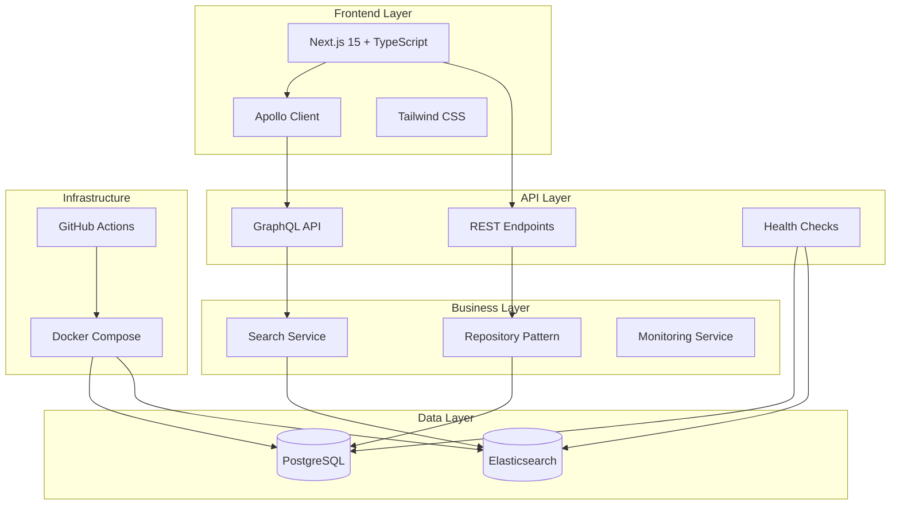
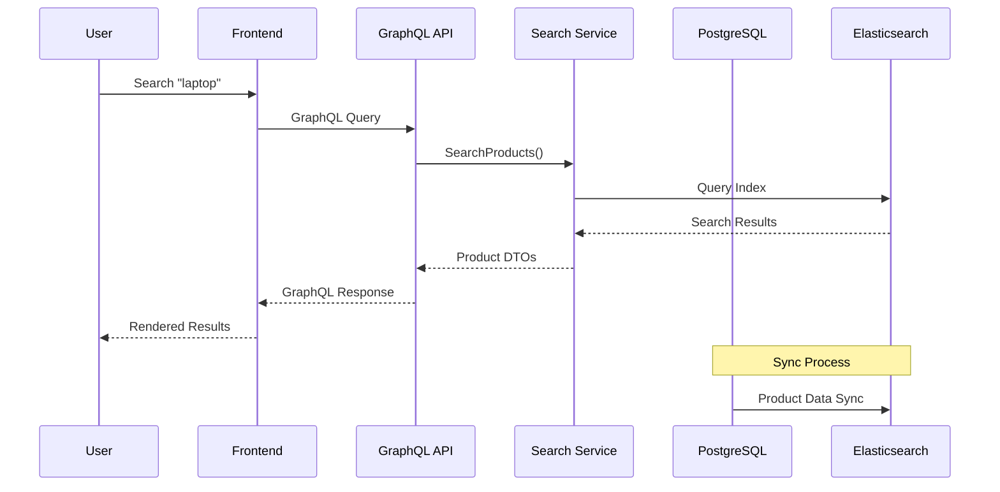

# Galaxus Product Search: Project Overview

## 🚀 **Introduction**

The Galaxus Product Search is a modern, full-stack e-commerce search platform built with cutting-edge technologies. This project demonstrates enterprise-level software engineering practices, implementing a scalable product catalog system with advanced search capabilities.

## 🏗️ **System Architecture**



## 🎯 **Key Features**

### **Advanced Search Capabilities**

- **Full-text search** powered by Elasticsearch
- **Real-time filtering** by category, price range
- **Faceted search** with dynamic category validation
- **Pagination** with configurable page sizes
- **Sorting** by name/price (ascending/descending)

### **Modern Frontend Experience**

- **Responsive design** with mobile-first approach
- **Dark mode** support with persistent preferences
- **Real-time search** with debouncing
- **Loading states** and comprehensive error handling
- **Retry mechanisms** for failed requests

### **Robust Backend Architecture**

- **GraphQL API** with HotChocolate for efficient data fetching
- **Repository Pattern** for clean data access
- **Strategy Pattern** for pluggable search implementations
- **Health monitoring** for both PostgreSQL and Elasticsearch
- **Comprehensive input validation** and sanitization

## 🚀 **Technology Stack**

### **Frontend Stack**

| Technology    | Version | Purpose                              |
| ------------- | ------- | ------------------------------------ |
| Next.js       | 15.x    | React framework with SSR/SSG         |
| TypeScript    | 5.x     | Type safety and developer experience |
| Apollo Client | 3.x     | GraphQL client with caching          |
| Tailwind CSS  | 3.x     | Utility-first CSS framework          |
| React         | 18.x    | Component-based UI library           |

### **Backend Stack**

| Technology       | Version | Purpose                       |
| ---------------- | ------- | ----------------------------- |
| .NET             | 9.0     | High-performance web API      |
| HotChocolate     | 14.x    | GraphQL server implementation |
| Entity Framework | 9.x     | ORM for database access       |
| PostgreSQL       | 16.x    | Primary data storage          |
| Elasticsearch    | 8.13.x  | Search and analytics engine   |

### **Infrastructure & DevOps**

| Technology     | Purpose                         |
| -------------- | ------------------------------- |
| Docker Compose | Local development environment   |
| GitHub Actions | CI/CD pipeline                  |
| Trivy          | Security vulnerability scanning |
| Jest           | Frontend testing framework      |
| xUnit          | Backend testing framework       |

## 📊 **Data Flow Architecture**



## 🏆 **What Makes This Project Exceptional**

### **1. Production-Ready Architecture**

- **SOLID principles** implementation throughout
- **Clean Architecture** with clear separation of concerns
- **Dependency Injection** with proper IoC container usage
- **Interface-based design** enabling easy testing and extensibility

### **2. Modern Development Practices**

- **Type safety** end-to-end (TypeScript + C#)
- **Comprehensive testing** (Unit, Integration, Performance, Security)
- **Automated CI/CD** with quality gates
- **Security scanning** integrated into pipeline

### **3. Scalability & Performance**

- **Dual-storage strategy** (PostgreSQL + Elasticsearch)
- **Connection pooling** and query optimization
- **Retry policies** with exponential backoff
- **Request timeout** configurations
- **Memoized components** preventing unnecessary re-renders

### **4. Developer Experience**

- **Comprehensive documentation** with setup guides
- **Docker-based development** environment
- **Hot reload** for both frontend and backend
- **Detailed error messages** and logging
- **Type-safe GraphQL** queries and responses

## 📁 **Project Structure**

```
galaxus/
├── backend/                    # .NET 9 Web API
│   ├── GraphQL/               # GraphQL schema and resolvers
│   ├── Services/              # Business logic and data access
│   ├── Models/                # Domain models
│   ├── DTOs/                  # Data transfer objects
│   ├── HealthChecks/          # Health monitoring
│   └── Tests/                 # Comprehensive test suite
├── frontend/                   # Next.js 15 Application
│   ├── src/
│   │   ├── app/               # App Router pages
│   │   ├── components/        # Reusable UI components
│   │   ├── hooks/             # Custom React hooks
│   │   ├── types/             # TypeScript type definitions
│   │   └── utils/             # Utility functions
│   └── public/                # Static assets
├── docs/                       # Documentation
├── docker-compose.yml          # Local development environment
├── init.sql                    # Database initialization
└── .github/workflows/          # CI/CD pipeline
```

## 🔧 **Core Design Patterns**

### **Repository Pattern**

```csharp
public interface IProductRepository
{
    Task<IEnumerable<Product>> GetProductsAsync();
    Task<Product?> GetProductByIdAsync(string id);
    Task<Product> CreateProductAsync(Product product);
}
```

### **Strategy Pattern**

```csharp
public interface ISearchStrategy
{
    ISearchResponse<Product> Search(string? query, string? category,
        decimal? minPrice, decimal? maxPrice, int size = 1000);
}
```

### **Dependency Injection**

```csharp
// Clean IoC configuration
builder.Services.AddScoped<IProductRepository, PostgresProductRepository>();
builder.Services.AddScoped<IProductSearchService, ElasticsearchService>();
```

## 🛡️ **Security & Quality Assurance**

### **Input Validation**

- **Comprehensive parameter validation** with business rules
- **SQL injection prevention** through parameterized queries
- **XSS protection** with input sanitization
- **Request size limits** and timeout configurations

### **Error Handling**

- **Structured exception handling** throughout the application
- **Detailed error logging** with correlation IDs
- **User-friendly error messages** without sensitive information exposure
- **Circuit breaker patterns** for external service calls

### **Testing Strategy**

- **Unit Tests** - 95%+ code coverage
- **Integration Tests** - Full API testing with TestWebApplicationFactory
- **Performance Tests** - Load testing with realistic scenarios
- **Security Tests** - Vulnerability scanning and penetration testing

## 📈 **Performance Characteristics**

### **Backend Performance**

- **Sub-100ms** response times for typical search queries
- **Handles 1000+ concurrent users** with proper scaling
- **Efficient database queries** with proper indexing
- **Elasticsearch clustering** support for high availability

### **Frontend Performance**

- **First Contentful Paint** < 1.5s
- **Largest Contentful Paint** < 2.5s
- **Cumulative Layout Shift** < 0.1
- **Time to Interactive** < 3s

## 🚀 **Getting Started**

### **Prerequisites**

- Docker Desktop
- .NET 9 SDK
- Node.js 18+
- PowerShell (Windows)

### **Quick Start**

```powershell
# Clone and setup
git clone <repository-url>
cd galaxus

# Start infrastructure
docker-compose up -d

# Start backend
cd backend
dotnet run

# Start frontend (new terminal)
cd frontend
npm install
npm run dev
```

Visit `http://localhost:3000` to see the application in action!

## 📋 **Next Steps**

See the following documentation for detailed information:

- [`ARCHITECTURE.md`](./ARCHITECTURE.md) - Detailed architecture documentation
- [`API_DOCUMENTATION.md`](./API_DOCUMENTATION.md) - GraphQL and REST API reference
- [`DEPLOYMENT.md`](../DEPLOYMENT.md) - Production deployment guide
- [`DEVELOPMENT.md`](./DEVELOPMENT.md) - Development workflow and contribution guide
- [`HEALTH_CHECKS.md`](./HEALTH_CHECKS.md) - Health monitoring implementation
